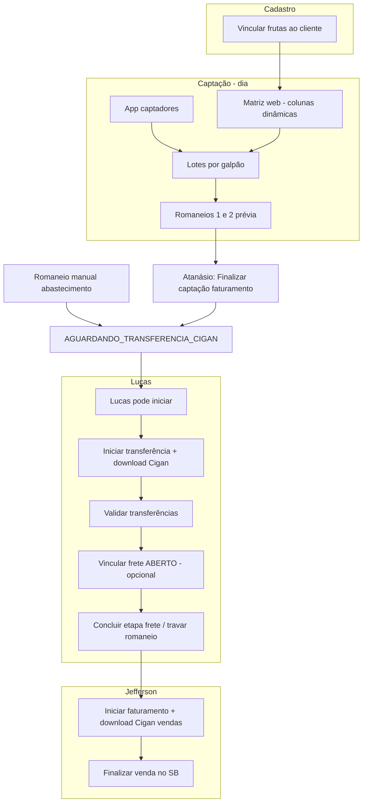

# PACOTE-0066: Captação de pedidos, romaneios, Cigan e pipeline operacional

**Data:** 2026-05-23
**Status:** Pronto para implementar (documentação + spec)

**Spec:** [2026-05-23-captacao-pedidos-romaneios-pipeline-design.md](../superpowers/specs/2026-05-23-captacao-pedidos-romaneios-pipeline-design.md)  
**Plano mestre:** [2026-05-23-captacao-pedidos-romaneios-pipeline.md](../superpowers/plans/2026-05-23-captacao-pedidos-romaneios-pipeline.md)

## Objetivo

Do pedido (app + matriz web) até vendas gerenciais no SB, com portões Atanásio → Lucas → Jefferson e arquivos Cigan para importação manual.

## ADRs e planos

| # | ADR | PLAN | Tema |
|---|-----|------|------|
| 0066 | [Captação, rotas, romaneios](../decisions/ADR-0066-captacao-pedido-romaneios-fechamento-diario.md) | [PLAN-0066](../plans/PLAN-0066-captacao-pedido-romaneios-fechamento-diario.md) | Lote por galpão, romaneios prévia/consolidado |
| 0067 | [Pipeline Lucas/Jefferson](../decisions/ADR-0067-pipeline-transferencia-lucas-venda-jefferson.md) | [PLAN-0067](../plans/PLAN-0067-pipeline-transferencia-lucas-venda-jefferson.md) | Cigan, transferência gerencial, vendas |
| 0068 | [API + matriz tempo real](../decisions/ADR-0068-api-pedidos-painel-matriz-tempo-real.md) | [PLAN-0068](../plans/PLAN-0068-api-pedidos-painel-tempo-real.md) | App, planilha web, autosave, Echo |
| 0069 | [Histórico pedido/item](../decisions/ADR-0069-pedido-historico-alteracoes.md) | [PLAN-0069](../plans/PLAN-0069-pedido-historico-alteracoes.md) | Auditoria APP/WEB |
| 0070 | [Finalizar captação faturamento](../decisions/ADR-0070-finalizar-captacao-unidade-faturamento.md) | [PLAN-0070](../plans/PLAN-0070-finalizar-captacao-unidade-faturamento.md) | Portão Atanásio → libera Lucas |
| 0071 | [Vínculo cliente×fruta](../decisions/ADR-0071-vinculo-cliente-fruta-matriz-dinamica.md) | [PLAN-0071](../plans/PLAN-0071-vinculo-cliente-fruta-matriz-dinamica.md) | Colunas dinâmicas na matriz (500+ frutas) |
| 0072 | [Frete pós-transferência lote](../decisions/ADR-0072-vinculo-frete-pos-transferencia-lote.md) | [PLAN-0072](../plans/PLAN-0072-vinculo-frete-pos-transferencia-lote.md) | Lucas vincula frete ABERTO (opcional) |
| 0073 | [App custo, preço/UM, margem](../decisions/ADR-0073-captacao-app-custo-preco-margem-um.md) | [PLAN-0073](../plans/PLAN-0073-captacao-app-custo-preco-margem-um.md) | Precificação na captação |
| 0074 | [Romaneio manual sem captação](../decisions/ADR-0074-romaneio-manual-abastecimento-sem-captacao.md) | [PLAN-0074](../plans/PLAN-0074-romaneio-manual-abastecimento-sem-captacao.md) | Reposição estoque → Lucas |
| 0075 | [Transferência gerencial Lucas](../decisions/ADR-0075-transferencia-gerencial-lucas-escopo-unidade.md) | [PLAN-0075](../plans/PLAN-0075-transferencia-gerencial-lucas-escopo-unidade.md) | Validar → movimentações auto |
| 0076 | [Captação D0 / faturamento D+1](../decisions/ADR-0076-calendario-captacao-d0-faturamento-d1.md) | [PLAN-0076](../plans/PLAN-0076-calendario-captacao-d0-faturamento-d1.md) | Timing Jefferson |
| 0077 | [PM único; CO venda HUB](../decisions/ADR-0077-custo-embutido-pm-e-co-venda-hub-praca.md) | [PLAN-0077](../plans/PLAN-0077-custo-embutido-pm-e-co-venda-hub-praca.md) | Custo captação e CO |
| 0078 | [Alertas loja dia semana](../decisions/ADR-0078-alertas-lojas-sem-pedido-dia-semana.md) | [PLAN-0078](../plans/PLAN-0078-alertas-lojas-sem-pedido-dia-semana.md) | Fase 2 — loja não pediu hoje |
| 0080 | [Alertas fruta ausente](../decisions/ADR-0080-alertas-fruta-habitual-ausente-romaneio.md) | [PLAN-0080](../plans/PLAN-0080-alertas-fruta-habitual-ausente-romaneio.md) | Fase 2 — fruta habitual faltando no romaneio |
| 0079 | [Import só cadastro](../decisions/ADR-0079-importacao-apenas-cadastro-sem-movimentacoes.md) | [PLAN-0079](../plans/PLAN-0079-importacao-apenas-cadastro-sem-movimentacoes.md) | Movimentação não importa mais |

**Dependências externas:** [ADR-0041](../decisions/ADR-0041-vincular-frete-transferencia-recebida-conforme.md), [ADR-0051](../decisions/ADR-0051-calendario-fretes-logistica.md), [ADR-0064](../decisions/ADR-0064-galpoes-operacionais-venda-tres-eixos.md), [ADR-0065](../decisions/ADR-0065-transferencia-sem-confirmacao-recebimento.md).

## Fluxo resumido

## Ordem de implementação

1. PLAN-0066 (lotes, rotas, romaneios prévia)
2. PLAN-0071 — vínculo cliente×fruta
3. PLAN-0068 + histórico (0069 passo 1) — API e matriz dinâmica
4. PLAN-0070 — finalizar captação Atanásio
5. PLAN-0067 + [PLAN-0072](PLAN-0072-vinculo-frete-pos-transferencia-lote.md) — Lucas, frete, Jefferson
6. Spec layouts Cigan (ADR futura)
7. Fase 2: [PLAN-0078](PLAN-0078-alertas-lojas-sem-pedido-dia-semana.md) + [PLAN-0080](PLAN-0080-alertas-fruta-habitual-ausente-romaneio.md)
8. [PLAN-0079](PLAN-0079-importacao-apenas-cadastro-sem-movimentacoes.md) no go-live (avisos UI)

**Operação paralela:** cadastro de fretes (ABERTOS) pode ocorrer antes ou durante a captação de pedidos.

## Fora de escopo (neste pacote)

- App mobile UI (só API contratada na 0068)
- Reabrir captação após finalizar
- Export automático sem download manual no MVP
- Remoção de código de importação legada ([ADR-0079](ADR-0079-importacao-apenas-cadastro-sem-movimentacoes.md) — manter por enquanto)

## Pendências

- Layout arquivos Cigan (transferência e venda)
- Biblioteca da matriz (licença Handsontable vs open source)

## Alinhamentos PDF (2026-05-23)

| Tópico | Decisão |
|--------|---------|
| A Fiscal vs gerencial | Gerencial automático na validação Lucas ([0075](ADR-0075)); Cigan em paralelo |
| B Margem captação | Só PM do estoque ([0077](ADR-0077), [0073](ADR-0073)) |
| C Timing venda | Captação D; faturamento D+1 ou na saída ([0076](ADR-0076)) |
| D CO praça | Embutido no PM; CO na margem só venda saída HUB ([0077](ADR-0077)) |
| F Fechar captação | Vínculo UN faturamento + permissão ([0070](ADR-0070)) |
| CO da praça | `pracas.id_unidade_negocio` ([0077](ADR-0077)) |
| Alertas comerciais | Loja sem pedido ([0078](ADR-0078)); fruta faltante por loja ([0080](ADR-0080)); ≥ 4 semanas |
| Importações | Só cadastro; movimentação legada ([0079](ADR-0079)) |
| Romaneio manual | Sem Jefferson ([0074](ADR-0074)) |

## Skill de manutenção

Ao alterar qualquer ADR deste pacote: usar `.cursor/skills/brainstorm-adr-pacote-implementacao/SKILL.md` e atualizar este arquivo.
