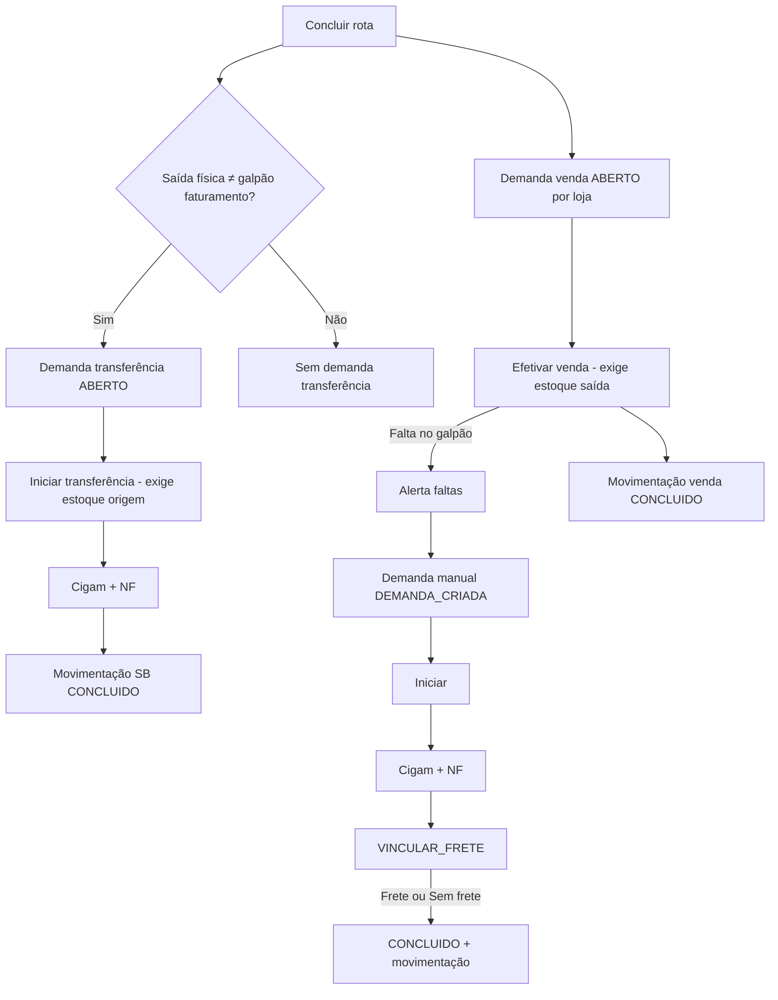

# PACOTE-0157: Demandas de rota — sem movimentação na captação

**Data:** 2026-05-28
**Status:** Pronto para implementar

## Objetivo

Na conclusão da rota de captação, registrar demandas de transferência e venda sem movimentar estoque; efetivar transferência e venda depois, por status e ação do usuário, com fluxo Cigam/NF para transferências.

## ADRs e planos

| # | ADR | PLAN | Tema |
|---|-----|------|------|
| 0157 | [ADR-0157](../decisions/ADR-0157-demandas-rota-sem-movimentacao-imediata.md) | [PLAN-0157](../plans/PLAN-0157-demandas-rota-sem-movimentacao-imediata.md) | Conclusão rota só monta demandas |
| 0158 | [ADR-0158](../decisions/ADR-0158-ciclo-demanda-transferencia-captacao.md) | [PLAN-0158](../plans/PLAN-0158-ciclo-demanda-transferencia-captacao.md) | Ciclo transferência + Cigam/NF |
| 0159 | [ADR-0159](../decisions/ADR-0159-venda-rota-desacoplada-transferencia.md) | [PLAN-0159](../plans/PLAN-0159-venda-rota-desacoplada-transferencia.md) | Venda manual, sem vínculo transferência |
| 0160 | [ADR-0160](../decisions/ADR-0160-demanda-transferencia-manual-multi-fruta.md) | [PLAN-0160](../plans/PLAN-0160-demanda-transferencia-manual-multi-fruta.md) | Transferência manual multi-fruta |
| 0161 | [ADR-0161](../decisions/ADR-0161-vincular-frete-demanda-manual.md) | [PLAN-0161](../plans/PLAN-0161-vincular-frete-demanda-manual.md) | Vincular frete após NF (manual) |

**Histórico:** [ADR-0154](../decisions/ADR-0154-transferencia-venda-pendente-conclusao-rota.md) substituída; [ADR-0155](../decisions/ADR-0155-status-demanda-rota-reabrir.md) atualizada (reabrir rota inalterada).

## Fluxo resumido

## Ordem de implementação

1. **PLAN-0157** — desbloqueia conclusão da rota (corrige Rota 1 sem estoque no HUB).
2. **PLAN-0158** — fluxo transferência automática captação.
3. **PLAN-0159** — vendas desacopladas + alerta faltas galpão.
4. **PLAN-0160** — demanda manual no módulo Transferências.
5. **PLAN-0161** — etapa vincular frete / sem frete antes da movimentação.

## Fora de escopo (neste pacote)

- Alterar pipeline de lote inteiro (transferência Cigam por lote legado).
- Preço na demanda manual.
- Estorno automático de venda/transferência já concluída ao reabrir rota (permanece bloqueio ADR-0155).

## Pendências / specs futuras

- Layout EDI Cigam por demanda agregada (rota + fruta) vs arquivo único por lote.
- FK opcional demanda manual → lote/rota captação.
