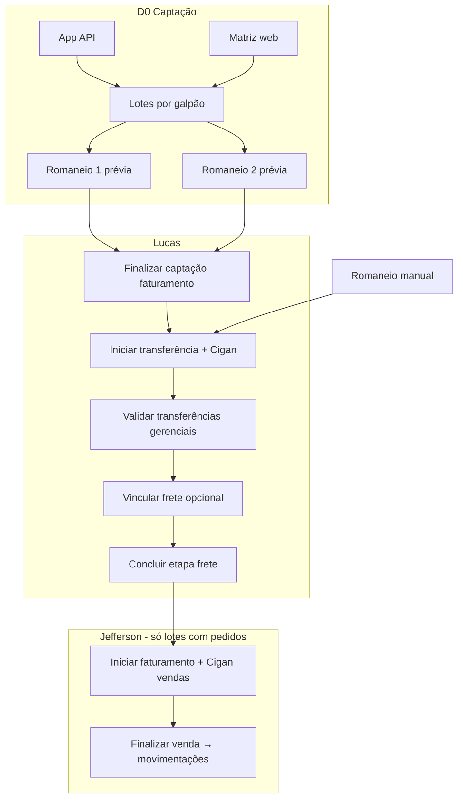

# PACOTE-0066: Captação, romaneios, pipeline Lucas/Jefferson e alertas comerciais

**Data:** 2026-05-23  
**Status:** Aprovado para planejamento  
**Índice:** [PACOTE-0066](../../pacotes/PACOTE-0066-captacao-pedidos-romaneios-pipeline.md)  
**Plano de execução:** [2026-05-23-captacao-pedidos-romaneios-pipeline.md](../plans/2026-05-23-captacao-pedidos-romaneios-pipeline.md)

## Objetivo

Substituir o fluxo operacional baseado em importação de movimentações por **captação de pedidos no SB** (app + matriz web), **romaneios**, exportação Cigan manual e **movimentações gerenciais** geradas por Lucas (transferência) e Jefferson (venda). Inclui alertas comerciais (fase 2) e depreciação operacional de import de movimentação.

## Contexto atual

| Existe | Falta |
|--------|--------|
| Movimentações: compra, venda, transferência, devolução, frete, ICMS | Entidades `Pedido`, lote captação, romaneios |
| Galpões operacionais, HUB, 3 eixos venda ([0064](../../decisions/ADR-0064-galpoes-operacionais-venda-tres-eixos.md)) | API app, matriz web, Echo |
| Transferência imediata sem recebimento ([0065](../../decisions/ADR-0065-transferencia-sem-confirmacao-recebimento.md)) | Pipeline status lote Cigan |
| Import planilha vendas/transferências/estoque | Captação como origem |
| `Praca.id_unidade_negocio`, `Cliente.id_praca` | Vínculo cliente×fruta dinâmico |

**Origem dos dados (virada):** Controladoria passa a ser origem; Cigan recebe **export** para importação fiscal manual. Import de **cadastro** continua; import de **movimentação** fica legado ([ADR-0079](../../decisions/ADR-0079-importacao-apenas-cadastro-sem-movimentacoes.md)).

## Decisões registradas (ADR)

| # | Tema | Arquivo |
|---|------|---------|
| 0066 | Lote por galpão, romaneios 1 e 2, sem movimentação na captação | [ADR-0066](../../decisions/ADR-0066-captacao-pedido-romaneios-fechamento-diario.md) |
| 0067 | Lucas: Cigan transf → validar → frete → travar; Jefferson: Cigan vendas → finalizar | [ADR-0067](../../decisions/ADR-0067-pipeline-transferencia-lucas-venda-jefferson.md) |
| 0068 | API Sanctum, matriz loja×fruta, autosave, tempo real | [ADR-0068](../../decisions/ADR-0068-api-pedidos-painel-matriz-tempo-real.md) |
| 0069 | Histórico obrigatório pedido/item APP/WEB | [ADR-0069](../../decisions/ADR-0069-pedido-historico-alteracoes.md) |
| 0070 | Finalizar captação por **faturamento** (UN vínculo + permissão) | [ADR-0070](../../decisions/ADR-0070-finalizar-captacao-unidade-faturamento.md) |
| 0071 | Colunas matriz = união vínculos cliente×fruta | [ADR-0071](../../decisions/ADR-0071-vinculo-cliente-fruta-matriz-dinamica.md) |
| 0072 | Frete ABERTO opcional por linha pós-validação | [ADR-0072](../../decisions/ADR-0072-vinculo-frete-pos-transferencia-lote.md) |
| 0073 | App: custo ref, preço/UM, margem na captação | [ADR-0073](../../decisions/ADR-0073-captacao-app-custo-preco-margem-um.md) |
| 0074 | Romaneio manual reposição — **sem Jefferson** | [ADR-0074](../../decisions/ADR-0074-romaneio-manual-abastecimento-sem-captacao.md) |
| 0075 | Transferência gerencial auto na validação Lucas | [ADR-0075](../../decisions/ADR-0075-transferencia-gerencial-lucas-escopo-unidade.md) |
| 0076 | Captação D0; faturamento/movimentação D+1 ou saída | [ADR-0076](../../decisions/ADR-0076-calendario-captacao-d0-faturamento-d1.md) |
| 0077 | Custo captação = PM galpão; CO margem só venda HUB via `pracas.id_unidade_negocio` | [ADR-0077](../../decisions/ADR-0077-custo-embutido-pm-e-co-venda-hub-praca.md) |
| 0078 | Alerta: loja habitual do dia sem pedido (≥4 semanas, 2/4) | [ADR-0078](../../decisions/ADR-0078-alertas-lojas-sem-pedido-dia-semana.md) |
| 0080 | Alerta: fruta habitual ausente no romaneio em montagem | [ADR-0080](../../decisions/ADR-0080-alertas-fruta-habitual-ausente-romaneio.md) |
| 0079 | Import só cadastro; movimentação legada (código mantido) | [ADR-0079](../../decisions/ADR-0079-importacao-apenas-cadastro-sem-movimentacoes.md) |

**Dependências já no código:** [0060](../../decisions/ADR-0060-venda-origem-comercial-saida-fisica-hub.md)–[0065](../../decisions/ADR-0065-transferencia-sem-confirmacao-recebimento.md), [0041](../../decisions/ADR-0041-vincular-frete-transferencia-recebida-conforme.md), [0051](../../decisions/ADR-0051-calendario-fretes-logistica.md).

## Modelo de dados (proposto)

### Núcleo captação

| Tabela | Responsabilidade |
|--------|------------------|
| `captacao_faturamento_dias` | `(data_referencia, id_unidade_faturamento)`, status fechamento ([0070](../../decisions/ADR-0070-finalizar-captacao-unidade-faturamento.md)) |
| `captacao_lotes` | Por galpão + data + faturamento; status pipeline ([0067](../../decisions/ADR-0067-pipeline-transferencia-lucas-venda-jefferson.md)) |
| `captacao_rotas` | Rotas por galpão |
| `pedidos` | Cabeçalho: cliente, lote, rota, datas, origem APP/WEB |
| `pedido_itens` | Produto, qty, preço, origem física, version para concorrência |
| `pedido_historicos` / `pedido_item_historicos` | Auditoria ([0069](../../decisions/ADR-0069-pedido-historico-alteracoes.md)) |
| `cliente_fruta_vinculos` | Frutas elegíveis por cliente ([0071](../../decisions/ADR-0071-vinculo-cliente-fruta-matriz-dinamica.md)) |
| `romaneio_carregamentos` / `romaneio_abastecimentos` | Romaneio 1 e 2 (prévia + consolidado) |
| `lote_cigan_exports` | Snapshot downloads transferência/venda |

### Romaneio manual ([0074](../../decisions/ADR-0074-romaneio-manual-abastecimento-sem-captacao.md))

- Tipo `ROMANEIO_MANUAL` no lote; fluxo Lucas até `TRANSFERENCIA_FINALIZADA`; sem etapa Jefferson.

### Status do lote (enum sugerido)

```
CAPTACAO_EM_ANDAMENTO
AGUARDANDO_TRANSFERENCIA_CIGAN      ← após finalizar faturamento
TRANSFERENCIA_CIGAN_INICIADA
AGUARDANDO_VINCULO_FRETE
TRANSFERENCIA_FINALIZADA
FATURAMENTO_CIGAN_INICIADO
VENDAS_FINALIZADAS
```

Romaneio manual: termina em `TRANSFERENCIA_FINALIZADA`.

## Fluxo operacional



## Componentes e interfaces

### Domínio (`app/`)

| Unidade | Interface |
|---------|-----------|
| `CaptacaoLoteService` | Abrir lote do dia/galpão; transições de status |
| `PedidoService` / `PedidoItemService` | CRUD; upsert célula matriz; travas por status |
| `RomaneioCarregamentoService` | Prévia/consolidação loja×rota |
| `RomaneioAbastecimentoService` | Prévia/consolidação fruta estoque vs a receber |
| `FinalizarCaptacaoFaturamentoAction` | Portão [0070](../../decisions/ADR-0070-finalizar-captacao-unidade-faturamento.md) |
| `EfetivarTransferenciasGerenciaisLoteAction` | [0075](../../decisions/ADR-0075-transferencia-gerencial-lucas-escopo-unidade.md) |
| `FinalizarVendasLoteAction` | Reusa `VendaMovimentacaoService` + CO [0077](../../decisions/ADR-0077-custo-embutido-pm-e-co-venda-hub-praca.md) |
| `GerarArquivoCigan*` | Export placeholder versionado até spec Cigan |
| `AlertasComerciaisQuery` | [0078](../../decisions/ADR-0078-alertas-lojas-sem-pedido-dia-semana.md) + [0080](../../decisions/ADR-0080-alertas-fruta-habitual-ausente-romaneio.md) |

### HTTP

| Camada | Rotas |
|--------|-------|
| `routes/api.php` | `api/v1/captacao/*` Sanctum |
| `routes/web.php` | `/admin/captacao/*` matriz, lotes, alertas, ações Lucas/Jefferson |
| Events | `PedidoItemAtualizado` → broadcast Reverb |

### UI admin

- Matriz: grade planilha (Handsontable ou alternativa open source — pendência licença).
- Dashboard lotes por status e faturamento.
- Alertas comerciais: abas **Lojas sem pedido** / **Frutas faltantes**.

### Integração com existente

- Transferências: `TransferenciaMovimentacaoService` na validação Lucas.
- Vendas: `VendaMovimentacaoService` na finalização Jefferson; `data_movimentacao` conforme [0076](../../decisions/ADR-0076-calendario-captacao-d0-faturamento-d1.md).
- Frete: fretes `ABERTO` existentes ([0072](../../decisions/ADR-0072-vinculo-frete-pos-transferencia-lote.md)).
- Escopo UN: padrão `UnidadeNegocioAccessService` / vínculos usuário.

## Travas de edição

| Evento | Qty pedido | Rota | Preço | Novo pedido |
|--------|------------|------|-------|-------------|
| Captação aberta | ✓ | ✓ | ✓ | ✓ |
| Faturamento finalizado | ✓* | ✗ | ✓ | ✗ |
| Lucas iniciou transferência | ✗ | ✗ | ✓ | ✗ |
| Lucas concluiu frete | ✗ | ✗ | ✗ | ✗ |

\*Até iniciar transferência.

## Alertas comerciais (fase 2)

**Pré-requisito:** ≥ 4 semanas de `pedido_itens`.

| Aba | Conjunto A (habitual) | Conjunto B (hoje) | Alerta |
|-----|----------------------|-------------------|--------|
| Lojas sem pedido | Clientes com pedido em ≥2/4 do mesmo weekday | Clientes com pedido no lote aberto | A − B |
| Frutas faltantes | Cliente×fruta habitual (≥2/4) | Frutas no pedido de lojas que **já** pediram hoje | A − B por loja |

Fonte: apenas pedidos do módulo novo — não vendas importadas.

## Precificação na captação ([0073](../../decisions/ADR-0073-captacao-app-custo-preco-margem-um.md) + [0077](../../decisions/ADR-0077-custo-embutido-pm-e-co-venda-hub-praca.md))

- **Custo referência (leitura):** PM do galpão na data; ICMS/frete embutidos no PM.
- **Margem exibida:** preço − custo ref; **não** inclui CO da praça (CO só na venda HUB em `resultado_movimentacao`).
- **CO na venda:** `cliente.id_praca` → `pracas.id_unidade_negocio` → `HistoricoCOUnNg` vigente.

## Permissões (sugestão)

| Permissão | Papel |
|-----------|-------|
| `captacao.lote.visualizar` | Matriz, romaneios prévia |
| `captacao.pedido.editar` | App/web captação |
| `captacao.faturamento.finalizar` | Fechar captação ([0070](../../decisions/ADR-0070-finalizar-captacao-unidade-faturamento.md)) |
| `captacao.lote.transferencia.iniciar` | Lucas |
| `captacao.lote.transferencia.validar` | Lucas |
| `captacao.lote.frete.vincular` | Lucas |
| `captacao.lote.frete.concluir` | Lucas |
| `captacao.lote.faturamento.iniciar` | Jefferson |
| `captacao.lote.venda.finalizar` | Jefferson |
| `captacao.romaneio.manual` | Reposição sem pedido |
| `captacao.alertas.visualizar` | Alertas 0078/0080 |

## Testes

- Feature tests por fase em `tests/Feature/Admin/Captacao/`.
- Fluxo integrado: captação → finalizar → Lucas → frete → Jefferson → movimentações.
- Concorrência matriz: 409 em versão de item.
- Alertas: datasets sintéticos 4 semanas.

## Fora de escopo (MVP)

- UI app mobile (só API [0068](../../decisions/ADR-0068-api-pedidos-painel-matriz-tempo-real.md))
- Reabrir captação após finalizar
- Remover código import movimentação
- Layout definitivo arquivos Cigan (export genérico até ADR futura)
- Devoluções no fluxo pedido

## Pendências explícitas

1. **Layout Cigan** — ADR dedicada quando operação entregar spec.
2. **Biblioteca matriz** — Handsontable vs Jspreadsheet vs AG Grid.
3. **Limiar alertas** — 2/4 fixo no MVP; configurável depois.

## Critérios de aceite do pacote

1. Pedido entra por API e matriz; romaneios prévia em tempo real.
2. Finalizar captação por faturamento bloqueia novos pedidos e libera Lucas.
3. Lucas gera Cigan, valida transferências gerenciais, vincula frete opcional, trava romaneio.
4. Jefferson gera Cigan vendas e finaliza movimentações no SB (D+1 conforme calendário).
5. Romaneio manual chega a `TRANSFERENCIA_FINALIZADA` sem Jefferson.
6. Margem captação usa PM; venda HUB usa CO da praça.
7. (Fase 2) Alertas comerciais após 4 semanas de dados.
8. (Go-live) Import movimentação marcada legado; operação usa captação.

## Referência de planos granulares

Cada ADR possui `docs/plans/PLAN-NNNN-*.md`. O plano mestre de execução está em `docs/superpowers/plans/2026-05-23-captacao-pedidos-romaneios-pipeline.md`.
