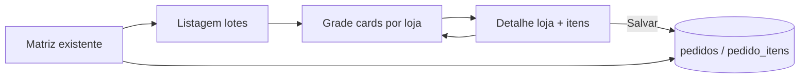

# Captação por loja (cards) — design

**Data:** 2026-05-25  
**Status:** Implementado (ver ADR-0087)  
**Relacionado:** [ADR-0073](../../decisions/ADR-0073-captacao-app-custo-preco-margem-um.md), [ADR-0071](../../decisions/ADR-0071-vinculo-cliente-fruta-matriz-dinamica.md), [ADR-0084](../../decisions/ADR-0084-captacao-dia-carteira-agenda-cliente.md), matriz web existente

## Objetivo

Oferecer um **segundo caminho** para lançar pedidos na captação do dia: em vez da matriz loja×fruta, uma tela com **cards por loja**; ao abrir a loja, ver o **último pedido da captação anterior** (referência) e digitar o **novo pedido** com quantidade e preço, exibindo custo, preço ideal e margens.

A **matriz** permanece; as duas telas gravam nos mesmos `pedidos` / `pedido_itens` do lote atual.

## Escopo

### Incluído (MVP)

- Menu **«Captação por loja»** (ou «Pedidos por loja») no bloco Captação, link a partir da listagem de lotes (lote em `CAPTACAO_EM_ANDAMENTO`).
- **Tela 1 — Grade de cards:** uma card por loja da carteira do lote (mesmo universo da matriz: clientes ativos da carteira com frutas vinculadas, ou todos da carteira com indicador «sem frutas»).
- **Tela 2 — Detalhe da loja:** formulário por fruta vinculada.
- **Referência — última captação:** último pedido do cliente no lote de captação **anterior** da **mesma carteira** (`CAPTACAO_PEDIDOS`, `data_referencia` &lt; data do lote atual, ordenar data desc, depois id desc).
- **Preços por linha (UM da fruta):**
  - **Custo referência** — PM do estoque do galpão do lote (somente leitura, [ADR-0073](ADR-0073-captacao-app-custo-preco-margem-um.md)).
  - **Preço vendido (referência)** — `preco_venda` de cada item do pedido anterior (somente leitura).
  - **Preço ideal** — calculado a partir do custo atual e do **% margem alvo** do cliente (novo campo cadastro).
  - **Preço de venda (real)** — campo editável; obrigatório ao informar quantidade &gt; 0.
- **Quantidade** — editável por fruta (mesma regra da matriz).
- Persistência via `PedidoService::salvarPedidoComItens` (origem `WEB`).
- Campo novo em `clientes`: `percentual_margem_alvo` (0–100, nullable, 2 decimais).
- Permissão: reutilizar `captacao.pedido.editar` (mesma da matriz).

### Fora do escopo (MVP)

- Tempo real / Echo entre matriz e por-loja (recarregar ao voltar é suficiente).
- App mobile (API pode reutilizar serviços depois).
- Alterar pipeline pós-captação, romaneio ou Cigan.

## Cadastro do cliente

| Campo | Tipo | Regra |
|-------|------|--------|
| `percentual_margem_alvo` | `decimal(5,2)` nullable | Margem **sobre o preço de venda** desejada para a loja (ex.: 30 = 30%). Vazio = não calcular preço ideal (exibir «—»). |

**Fórmula preço ideal** (alinhada a [ADR-0073](ADR-0073-captacao-app-custo-preco-margem-um.md)):

```
margem% = (preco_venda - custo) / preco_venda × 100
preco_ideal = custo / (1 - percentual_margem_alvo/100)   se 0 < alvo < 100 e custo > 0
```

Exibir também **margem real** ao digitar preço: `margem%` e `margem R$/UM` em tempo real (JS + validação servidor).

## Fluxo de telas



### Card (resumo)

- Nome da loja (fantasia / razão social).
- Badge: «com pedido hoje» / «pendente» / «sem frutas vinculadas».
- Opcional: total de itens ou soma qty no pedido atual do lote.

### Detalhe da loja

Seção **«Última captação»** (colapsável se vazio): data do lote anterior, tabela somente leitura (fruta, qty, preço vendido, custo snapshot da época se existir).

Seção **«Pedido de hoje»:** uma linha por fruta vinculada ao cliente:

| Coluna | Editável |
|--------|----------|
| Fruta (UM) | Não |
| Qty | Sim |
| Custo ref. (hoje) | Não |
| Preço vendido (ref.) | Não |
| Preço ideal | Não (calculado) |
| Preço venda (real) | Sim |
| Margem % / R$ | Não (calculado) |

Botões: **Salvar**, **Voltar aos cards**.

## Abordagens consideradas

| Abordagem | Prós | Contras |
|-----------|------|---------|
| **A — Telas web dedicadas (recomendada)** | UX focada; reutiliza `PedidoService`; independente da matriz | Mais views/rotas |
| **B — Drawer/modal na grade sem segunda URL** | Menos navegação | URL não compartilhável; estado pesado |
| **C — Só estender matriz com modo «por loja»** | Um único controller | Matriz já complexa; mistura UX |

**Recomendação:** **A**.

## Arquitetura técnica

### Novos artefatos

| Artefato | Responsabilidade |
|----------|------------------|
| `CaptacaoPedidoPorLojaController` | `index` (cards), `show` (detalhe), `store`/`update` (salvar) |
| `CaptacaoPedidoPorLojaService` | Montar DTO: lojas do lote, pedido anterior, pedido atual, precificação |
| `CaptacaoPrecificacaoService` | Estender: `precoIdealPorMargemAlvo(custo, percentual)` |
| Migration `clientes.percentual_margem_alvo` | Cadastro |
| Views `admin/captacao/pedidos-por-loja/` | `index.blade.php`, `show.blade.php` |
| Testes feature | Cards, detalhe, salvar, preço ideal, pedido anterior |

### Rotas (prefixo `admin/captacao/lotes/{lote}/pedidos-por-loja`)

- `GET /` → grade
- `GET /{cliente}` → detalhe
- `PUT /{cliente}` → salvar pedido do dia

### Última captação (query)

```sql
-- conceito
SELECT pedidos.* FROM pedidos
JOIN captacao_lotes l ON l.id = pedidos.id_captacao_lote
WHERE pedidos.id_cliente = :cliente
  AND l.id_captacao_carteira = :carteira
  AND l.tipo = 'CAPTACAO_PEDIDOS'
  AND l.data_referencia < :data_lote_atual
ORDER BY l.data_referencia DESC, l.id DESC
LIMIT 1
```

## ADR / plano

- Criar **ADR-0087** — margem alvo no cliente + captação por loja.
- Criar **PLAN-0087** — passos de implementação.

## Critérios de aceite

1. Com lote em captação, usuário abre «Captação por loja», vê cards das lojas da carteira.
2. Ao abrir uma loja com pedido na captação anterior, vê qty e preço vendido por fruta.
3. Com `percentual_margem_alvo` preenchido e custo disponível, vê preço ideal calculado.
4. Salva qty + preço real; matriz do mesmo lote reflete os valores.
5. Cliente sem margem alvo: preço ideal exibido como «—», sem bloquear salvamento.

## Pergunta em aberto

**Universo de cards:** listar **todas as lojas da carteira** (como matriz após ADR-0084) ou apenas lojas **já adicionadas** ao pedido do lote?  
**Proposta MVP:** todas da carteira com frutas vinculadas; lojas sem frutas aparecem desabilitadas com aviso «vincule frutas em Frutas por loja».

---

*Após aprovação deste spec, seguir PLAN-0087 e gate de pré-implementação.*
